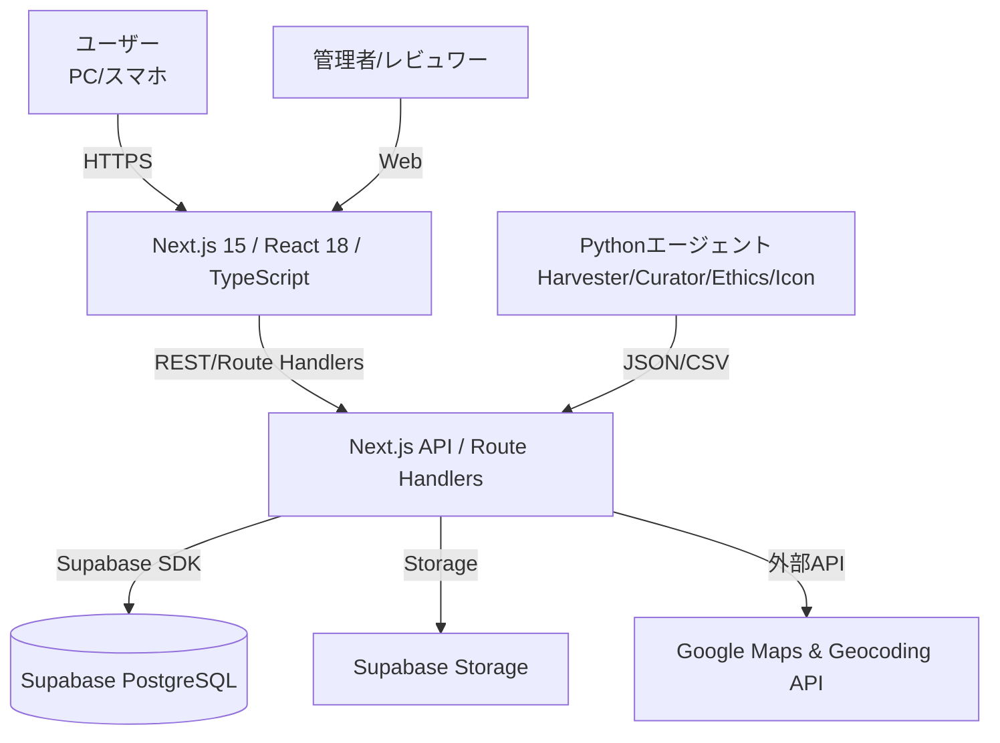

# 基本設計（Basic Design）— 民俗学版「大島てる」
対象：Sechack365発表用 / 初学者向けに丁寧な説明 / Ubuntu + Node.js + Python / Google Maps

---

## 1. システム全体構成（論理アーキテクチャ）

- **フロント**：Next.js App Router、Tailwind、shadcn/ui（任意）
- **バックエンド**：Next.js Route Handlers（/api/*）でREST風に実装
- **DB**：Supabase(PostgreSQL) + Prisma、RLSで行レベル権限
- **AI前処理**：Pythonスクリプト（手動 or codex CLIで呼び出し）
- **地図**：Google Maps JavaScript API（将来、古地図タイル重ねに拡張）

---

## 2. 画面設計（ワイヤーフレーム／UI遷移）
### 2.1 画面一覧
1. **トップ（/）= 地図ビュー**
   - 検索バー（住所/地名/キーワード）
   - 地図（Google Maps）：マーカー表示、アイコン種別（鬼/狐/寺/社/動物/その他）
   - トグル：「古地図を重ねる（β）」
   - 右ペイン：絞り込み（タグ、時代、公開状態）
   - マーカークリック → 詳細モーダル
2. **詳細モーダル**
   - タイトル、要約説明、出典リンク（必須）、時代ヒント
   - アイコン種別、座標（ぼかし済み）、最終更新者、更新日時
   - 通報ボタン（不適切/誤り/差別/プライバシー）
3. **投稿フォーム（/post）**
   - タイトル*、本文*、出典*、画像（任意）
   - 地名/住所 → 自動ジオコーディング（確認用ミニ地図）
   - アイコン候補（AI推定を表示して手動選択可能）
   - 送信：`draft` で保存
4. **レビューパネル（/review）**
   - `draft/review` 一覧、差分表示
   - チェックリスト（誤情報/差別・偏見/プライバシー/出典）
   - アクション：`publish` / `reject` / `needs-fix`
5. **通報一覧（/flags）**
   - 通報理由、該当スポット、対応ステータス
   - ワンクリック非公開 & コメント追加
6. **ログイン/ユーザー設定（/account）**

**アクセシビリティ**
- キーボード操作全対応、ARIAラベル、コントラストAA
- アイコンには意味ラベル（例：`aria-label="鬼の伝説"`）

---

## 3. データ設計（概要）
### 3.1 エンティティ関連（ER 概要）
- **spots**（地点・記事）1 — *N* **sources**（出典）  
- **spots** 1 — *N* **flags**（通報）  
- **audits** は操作履歴（任意のエンティティに紐付く）

### 3.2 主要テーブル（要約）
- `spots(id, title, description, lat, lng, icon_type, era_hint, blur_radius_m, status, created_by, updated_at)`
- `sources(id, spot_id, type, citation, url)`
- `flags(id, spot_id, reason, note, created_by, status, created_at)`
- `audits(id, entity, entity_id, action, detail_json, by, at)`

**注意**：公開は `status = 'published'` のみ。座標は保存時に**ぼかし**を適用。

---

## 4. API設計（/api 配下）
**表記**：`Auth` は Supabase Auth の JWT、`role` は RLS 切り替えに使用。  
レスポンスは JSON。エラーは `{error:{code,message}}` 形式（HTTP ステータス適正化）。

### 4.1 Spot
- `GET /api/spots?bbox=&q=&tags=&era=&status=`  
  - 地図領域（bbox: west,south,east,north）＋検索。公開のみデフォルト。
- `GET /api/spots/:id`  
  - 単体取得。公開 or 権限者。
- `POST /api/spots`（Auth: editor+）  
  - 送信は `draft` 固定。`title, description, place_hint|address, sources[]`
- `PATCH /api/spots/:id`（Auth: editor+）  
  - 編集。`status` 変更は reviewer+ 限定。
- `POST /api/spots/:id/publish`（Auth: reviewer+）  
  - 倫理チェック通過で `published` に遷移。
- `DELETE /api/spots/:id`（Auth: admin）

### 4.2 Geocode
- `POST /api/geocode`（Auth: editor+）  
  - 入力：`{text:"広島県福山市〇〇"}` → 出力：`{lat,lng,confidence,blur_radius_m}`

### 4.3 Sources
- `POST /api/spots/:id/sources`（editor+）
- `DELETE /api/sources/:id`（editor+）

### 4.4 Flags
- `POST /api/flags`（誰でも可 / recaptcha）  
  - `{spot_id, reason, note}` → `status=open`
- `PATCH /api/flags/:id`（reviewer+）  
  - `status` 変更、コメント。

### 4.5 Auth/Account
- Supabase Auth（メールリンク）に委譲。ユーザー情報は `profiles` にメタ保存。

---

## 5. 権限設計（RLS/ロール）
- **viewer**：公開データ閲覧のみ
- **editor**：自分の `draft` 作成/編集、`review` 申請
- **reviewer**：レビュー・公開／非公開、通報対応
- **admin**：全権（スキーマ変更は別途）

**RLS ポリシー例**
- `spots.status='published'` は全員 SELECT 可
- `spots.created_by = auth.uid()` の行は作成者が UPDATE 可（published 以外）
- `reviewer/admin` は全 UPDATE 可（権限クレームで判定）

---

## 6. 業務フロー（代表ユースケース）
### 6.1 投稿→公開フロー
1. editor が投稿（draft）  
2. reviewer がレビュー（チェックリスト：出典・差別・プライバシー・誤情報）  
3. 問題なければ publish、問題あれば needs-fix で差戻し  
4. audits に履歴を記録、公開後は地図に反映

### 6.2 通報→対応
1. viewer/editor が通報送信  
2. reviewer が `flags` を確認、該当 `spot` を一時非公開にすることも可能  
3. 修正後に再公開、または削除

---

## 7. バリデーション／入力規則
- **title**：必須、2〜80字
- **description**：必須、3000字以内。出典明記。引用は短く、要約中心。
- **sources**：1件以上必須。`type(url|book|interview)`、`url` は形式チェック。
- **address/place_hint**：必須。ジオコーディング必須。
- **icon_type**：`oni|kitsune|dog|dragon|temple|shrine|animal|generic`
- **ぼかし**：`blur_radius_m` を 100/200/300 から自動選択（ゼロ不可）。

---

## 8. 非機能の具体化（性能・セキュリティ）
- **性能**：`GET /api/spots?bbox=` は DB のジオインデックス（`PostGIS` or `earthdistance` 相当）を検討。初期は矩形 & LIMIT 200。  
- **CSP**：`script-src 'self' https://maps.googleapis.com 'unsafe-inline'` 等。  
- **Rate Limit**：`/api/geocode` は1IPあたり 30 req/min。  
- **画像**：拡張子/サイズ制限、EXIF削除（個人情報回避）。

---

## 9. ディレクトリ構成（Next.js）
```
/app
  /(public)/page.tsx         # 地図トップ
  /post/page.tsx             # 投稿フォーム
  /review/page.tsx           # レビューパネル
  /flags/page.tsx            # 通報一覧
  /api/spots/route.ts        # GET/POST
  /api/spots/[id]/route.ts   # GET/PATCH/DELETE
  /api/spots/[id]/publish/route.ts
  /api/geocode/route.ts
/lib
  /db.ts                     # Prisma/Supabase クライアント
  /auth.ts                   # ロール判定
  /validators.ts             # Zod スキーマ
  /maps.ts                   # Google Maps helper
/components
  Map.tsx, SpotCard.tsx, SpotForm.tsx, ReviewList.tsx
/prisma
  schema.prisma
/python
  harvester.py curator.py ethics_gate.py icon_tagger.py
```

---

## 10. 環境変数・設定
- `GOOGLE_MAPS_API_KEY`：Maps/Geocoding 用
- `DATABASE_URL`：Supabase Postgres／開発は SQLite でも可
- `SUPABASE_URL` / `SUPABASE_ANON_KEY`：Auth/Storage 用
- `NEXT_PUBLIC_SITE_NAME`：サイト名

---

## 11. 試験観点（基本）
- 画面：マーカー表示、検索、古地図トグル
- API：一覧/詳細/投稿/公開/通報
- RLS：作成者編集の可否、公開可視性
- 倫理：差別・プライバシー検知の単体テスト（疑似入力）
- 負荷：`GET /api/spots?bbox=` の p95 < 300ms（サンプル1万件）

---

## 12. 将来拡張
- MapLibre で古地図タイル本格対応（今昔マップ相当レイヤ）
- i18n（英語）
- 推薦・近隣スポット提示、回遊動線を強化（観光用途）

```