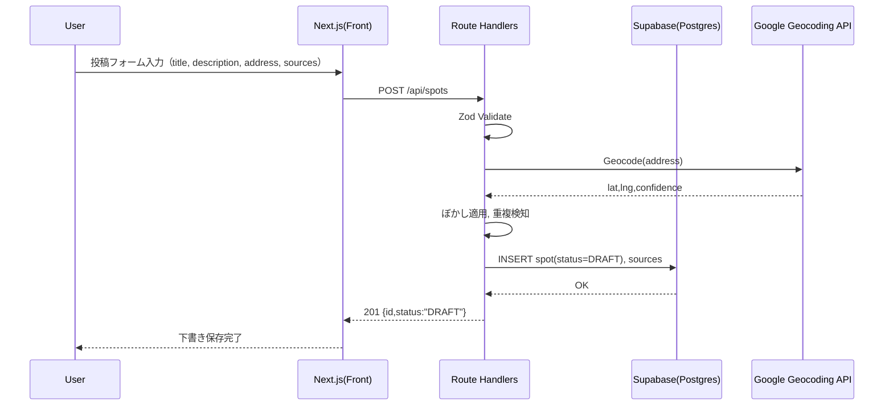
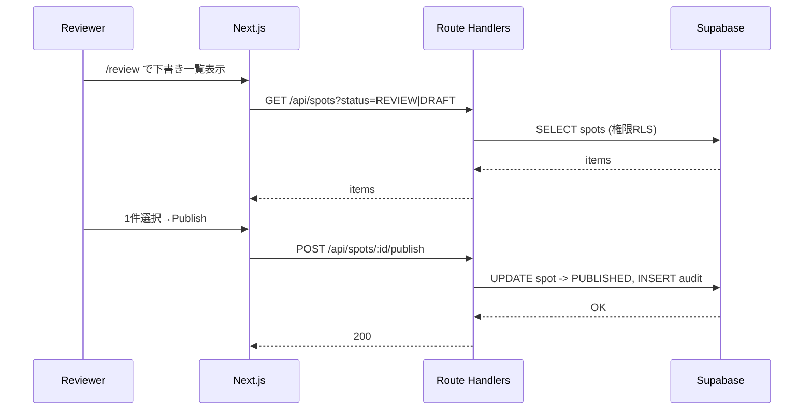
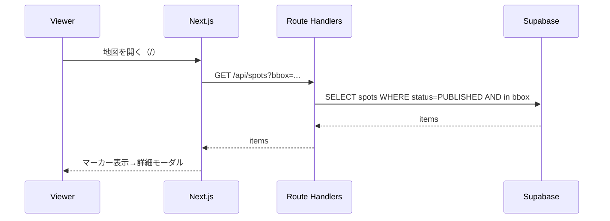

# シーケンス図（主要ユースケース）

```mermaid
sequenceDiagram
  participant U as User
  participant FE as Next.js(Front)
  participant API as Route Handlers
  participant DB as Supabase(Postgres)
  participant GM as Google Geocoding API

  U->>FE: 投稿フォーム入力（title, description, address, sources）
  FE->>API: POST /api/spots
  API->>API: Zod Validate
  API->>GM: Geocode(address)
  GM-->>API: lat,lng,confidence
  API->>API: ぼかし適用, 重複検知
  API->>DB: INSERT spot(status=DRAFT), sources
  DB-->>API: OK
  API-->>FE: 201 {id,status:"DRAFT"}
  FE-->>U: 下書き保存完了
```

```mermaid
sequenceDiagram
  participant R as Reviewer
  participant FE as Next.js
  participant API as Route Handlers
  participant DB as Supabase

  R->>FE: /review で下書き一覧表示
  FE->>API: GET /api/spots?status=REVIEW|DRAFT
  API->>DB: SELECT spots (権限RLS)
  DB-->>API: items
  API-->>FE: items
  R->>FE: 1件選択→Publish
  FE->>API: POST /api/spots/:id/publish
  API->>DB: UPDATE spot -> PUBLISHED, INSERT audit
  DB-->>API: OK
  API-->>FE: 200
```

```mermaid
sequenceDiagram
  participant V as Viewer
  participant FE as Next.js
  participant API as Route Handlers
  participant DB as Supabase

  V->>FE: 地図を開く（/）
  FE->>API: GET /api/spots?bbox=...
  API->>DB: SELECT spots WHERE status=PUBLISHED AND in bbox
  DB-->>API: items
  API-->>FE: items
  FE-->>V: マーカー表示→詳細モーダル
```